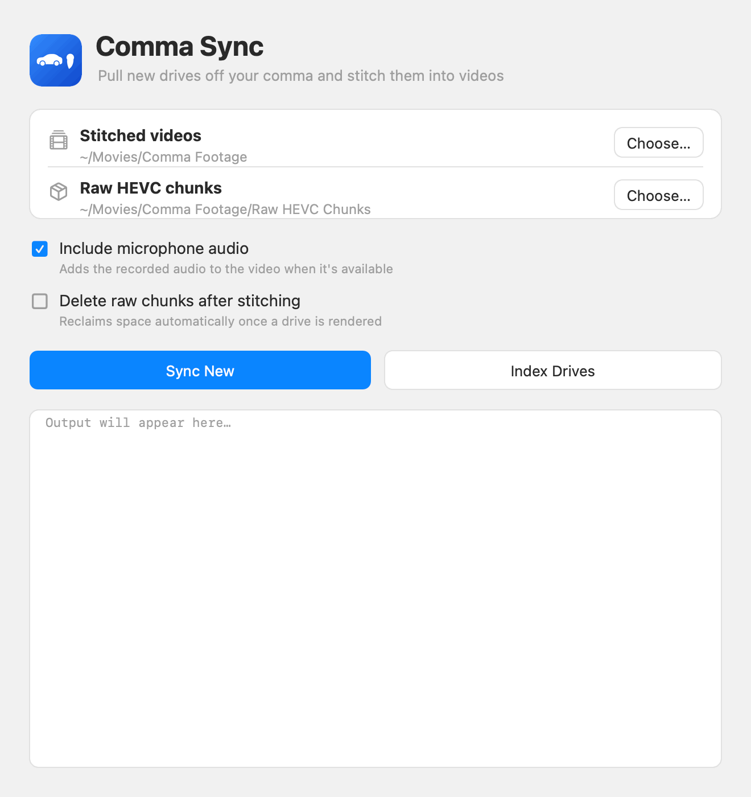
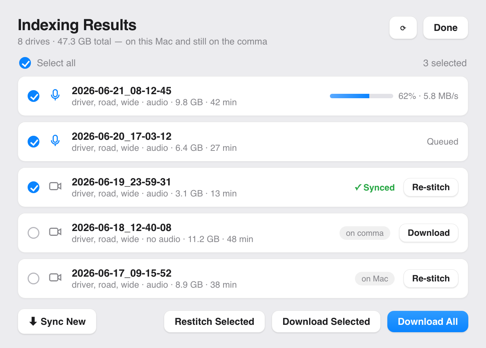
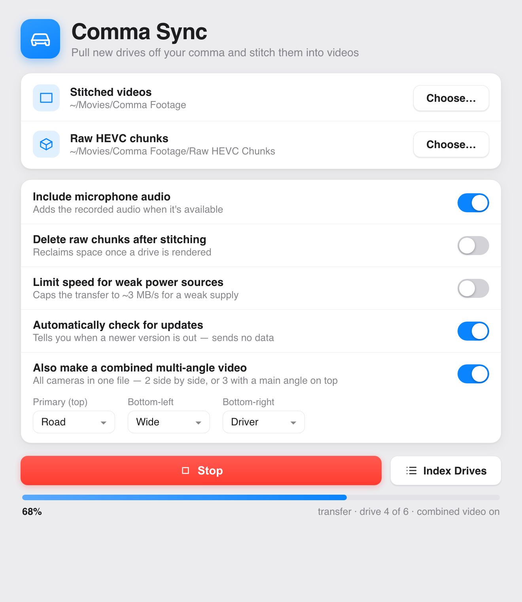
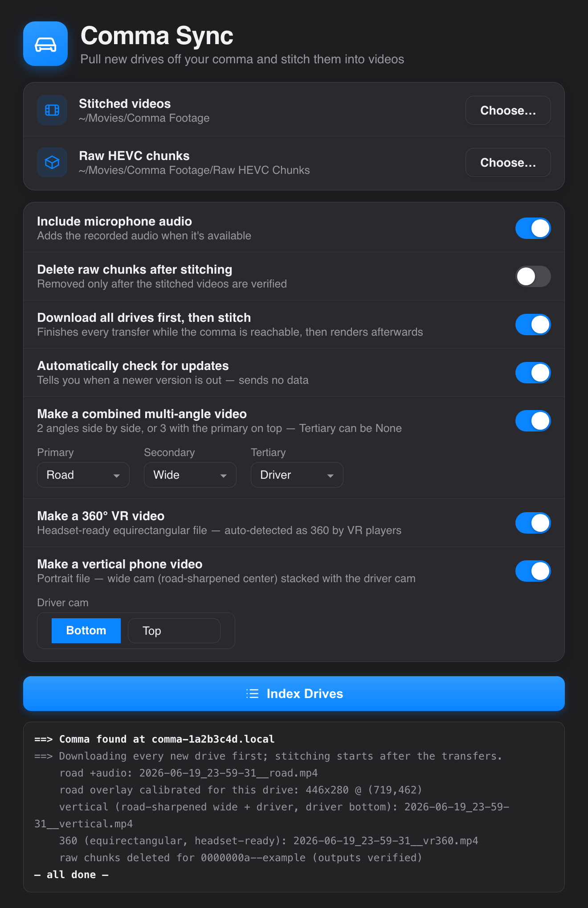

# Comma Sync

[](https://github.com/sourylime/comma-sync/actions/workflows/ci.yml)
[](LICENSE)
[](ROADMAP.md)

Pull dashcam footage off your [comma](https://comma.ai) device over your local network and
stitch each drive into a single playable video — **with audio** — without uploading anything
to the cloud. One native app for **macOS, Linux, and Windows**.

comma/openpilot store footage as one-minute **segments** of raw HEVC, split per camera,
in `/data/media/0/realdata/` on the device. Getting a watchable video out normally means
SSH, `scp`, and manual `ffmpeg` work. Comma Sync does it all for you:



### Screenshots

| Index Drives | Sync in progress |
|:---:|:---:|
|  |  |
| Browse every drive — on your computer *and* still on the comma — and download some or all. | Live progress bar and log while it pulls and stitches each drive. |



*Follows your system's light or dark appearance. All screenshots use made-up example data — drive names, sizes, and paths are not real.*

- 🔍 **Auto-discovers** the device on your WiFi (its IP usually changes every connect).
- ⬇️ **Pulls only new drives** — a ledger tracks what's done, so nothing re-downloads.
- 🎬 **Stitches** each drive into one MP4 per camera (road / wide / driver), named by the
  recording start time.
- 🎞️ **Optional combined multi-angle video** — 2 cameras side by side, or 3 with a main angle
  on top and the other two below. Re-render with a different layout anytime; it keeps each
  layout as its own file and skips one it has already made.
- 🔊 **Adds the microphone audio** when it was recorded.
- ♻️ **Re-sync or re-stitch anything**, even old drives you deleted locally — it pulls them back.
- 🖥️ **Native app on macOS, Linux, and Windows** — pick folders, watch a progress bar,
  browse/index every drive (on your computer *and* still on the comma), select some/all, and
  download — with the ability to close it and come back while it keeps working.

> Tested on a **comma 3X** running [sunnypilot](https://github.com/sunnypilot/sunnypilot).
> Should also work with stock openpilot and other forks that keep the standard layout.

---

# Install

Comma Sync is one native app for **macOS, Linux, and Windows**, all on the same engine.

### 1. Install ffmpeg (the only dependency)

The app shells out to `ffmpeg`/`ffprobe` to stitch the video — everything else (device
discovery, SSH, file transfer) is built in. Install it once:

- **macOS:** `brew install ffmpeg`  *(get [Homebrew](https://brew.sh) first if you don't have it)*
- **Linux:** `sudo apt install ffmpeg` (Debian/Ubuntu) · `sudo dnf install ffmpeg` (Fedora)
- **Windows:** `winget install Gyan.FFmpeg`, then **close and reopen** your terminal so it's found

### 2. Download it

Grab the latest build for your system from the
[**Releases page**](https://github.com/sourylime/comma-sync/releases/latest) → **Assets**:

| Your computer | Download |
|---------------|----------|
| **macOS** | `Comma-Sync-macOS.zip` |
| **Linux** | `Comma.Sync_*_amd64.AppImage` (simplest) — or `.deb` / `.rpm` |
| **Windows** | `Comma.Sync_*_x64-setup.exe` (installer) — or `.msi` |

*(Each OS also has a `SHA256SUMS-*.txt` if you want to verify your download.)*

### 3. Open it

- **macOS:** unzip to get **`Comma Sync.app`** and drag it to Applications. It's a free
  open-source app (unsigned), so the first time **right-click it → Open**, then click **Open**
  in the dialog (after that, just double-click).
- **Linux (AppImage):** `chmod +x Comma.Sync_*_amd64.AppImage` then run it — or install the
  `.deb` (`sudo apt install ./Comma.Sync_*_amd64.deb`) or `.rpm` (`sudo dnf install ./*.rpm`).
- **Windows:** run the `*-setup.exe` (or `.msi`). It isn't code-signed yet, so **SmartScreen**
  may warn — click **More info → Run anyway**.

### 4. Let the app talk to your comma (one-time)

The comma only allows computers whose SSH key is registered to it via a GitHub account.

1. **Make an SSH key.** This is a pair of files your computer uses to prove it's you —
   you only need to do this once per computer (skip it if you already have a file at
   `~/.ssh/id_ed25519`).
   - **macOS:** open **Terminal** (⌘+Space, type "Terminal", press Return).
   - **Linux:** open your terminal app.
   - **Windows:** open **PowerShell** (press the Windows key, type "PowerShell", press
     Enter) — it's built into Windows 10/11, nothing to install.

   Then, in that terminal window, type this and press Return:
   ```
   ssh-keygen -t ed25519
   ```
   It'll ask **"Enter file in which to save the key"** and **"Enter passphrase"** —
   just press Return at each prompt to accept the defaults (no passphrase). That
   creates two files: a private key (never share this one) and a matching `.pub`
   ("public") file, which is the one you'll copy in the next step:
   - **macOS / Linux:** `~/.ssh/id_ed25519.pub`
   - **Windows:** `%USERPROFILE%\.ssh\id_ed25519.pub` (typically
     `C:\Users\<your username>\.ssh\id_ed25519.pub`)

   That `~` is just shorthand for your home folder, not a real folder to browse to —
   the easiest way to get the key is straight from the terminal. **To open it** in
   your OS's default text editor, paste one of these into the same terminal window and
   press Return:
   - **macOS:** `open -e ~/.ssh/id_ed25519.pub`
   - **Linux:** `xdg-open ~/.ssh/id_ed25519.pub`
   - **Windows (PowerShell):** `notepad $env:USERPROFILE\.ssh\id_ed25519.pub`

   Or **skip opening it entirely** and copy the key straight to your clipboard:
   - **macOS:** `pbcopy < ~/.ssh/id_ed25519.pub`
   - **Linux:** `xclip -sel clip < ~/.ssh/id_ed25519.pub` (if that command isn't found,
     install it first: `sudo apt install xclip`, then run it again)
   - **Windows (PowerShell):** `Get-Content $env:USERPROFILE\.ssh\id_ed25519.pub | Set-Clipboard`
2. **Add the `.pub` key to a GitHub account.** If you copied it to the clipboard above,
   just paste it. Otherwise, in the text editor that opened, select all and copy — it's
   one long line starting with `ssh-ed25519`. Go to
   [github.com/settings/keys](https://github.com/settings/keys) → **New SSH key**,
   paste it in, and save. (Don't have a GitHub account? Making one is free at
   [github.com](https://github.com).)
3. **On the comma:** Settings → Developer → enable **SSH**, and enter **that GitHub username**.
   (On sunnypilot it's under the Developer section.)

### 5. Use it

1. Make sure the comma is powered on and on the **same WiFi** as your computer.
2. Open **Comma Sync**, pick where to save videos, and click **Index Drives** to see every
   drive and its size.
3. Tick the ones you want (or **Download All**) and watch them transfer. Done!

> A **phone hotspot** works fine for this — the transfer stays local between the comma and
> your computer, so it doesn't use any of your carrier data. A proper **WiFi router** is
> still the better choice when you have one, since it's generally faster and more stable
> for long or large drives.

---

# Advanced (environment variables)

Under the hood the app runs a single cross-platform **Go core** ([`core/`](core)) that you can
also run from a terminal (`comma-sync sync` / `list` / `restitch <route>` / `discover`). Its
behavior is tuned with environment variables:

| Variable | Default | Purpose |
|----------|---------|---------|
| `ROOT` | `./Comma Footage` | Where stitched videos go |
| `CHUNKS_DIR` | `ROOT/Raw HEVC Chunks` | Where raw chunks are kept |
| `WITH_AUDIO` | `1` | Mux mic audio when present (`0` = video only) |
| `WITH_COMBINED` | `0` | `1` = also render the combined multi-angle video |
| `PRIMARY_CAM` / `SECONDARY_CAM` / `TERTIARY_CAM` | `road` / `wide` / `driver` | Combined-video slots (labels `road`\|`wide`\|`driver`) |
| `CLEAN_RAW` | `0` | `1` = delete a drive's chunks after stitching |
| `COMMA_IP` | _(empty)_ | Pin a fixed IP instead of auto-discovering |
| `REMOTE_PORT` | `22` | SSH port (older devices used `8022`) |
| `SSH_KEY` | `~/.ssh/id_ed25519` | Private key to authenticate with |
| `USE_USB` | `0` | `1` = transfer over a USB-C/ADB link instead of WiFi (enable ADB on the comma; not faster than WiFi) |
| `BWLIMIT` | _(none)_ | Cap the transfer rate (e.g. `3m` = 3 MB/s) to lower the comma's power draw if it reboots mid-transfer |

> **Legacy:** the original engine was a single bash script,
> [`comma-sync.sh`](comma-sync.sh) (rsync + ssh + ffmpeg, macOS/Linux only). It's **retired** in
> favor of the cross-platform app above, but it's kept in the repo for anyone who wants it — and
> the last script-based release,
> [v1.0.6](https://github.com/sourylime/comma-sync/releases/tag/v1.0.6), stays downloadable.

# Contributing & status

Comma Sync runs on **macOS, Linux, and Windows** from one shared **Go core** — native SSH/SFTP
and device discovery are built in; only `ffmpeg` is external. The macOS UI is SwiftUI; Linux and
Windows use a Tauri front-end. Both drive the same core.

Found a bug or want to help? **[Open an issue](https://github.com/sourylime/comma-sync/issues)**,
or fork the repo, work on a branch, and open a pull request.

# Troubleshooting

The comma can reboot randomly during transfers, but the app picks back up where it left off and
eventually gets the whole drive. If it's rebooting often:

- **Best:** transfer with the **engine running** (alternator → stable harness power), or power the
  device from a proper **high-current USB-C supply** (not a laptop port or a weak charger). Make
  sure the cable is fully seated.
- **Mitigate:** turn on **"Limit speed for weak power sources"** in the app (or set `BWLIMIT=3m`
  for the CLI) to lower the power draw.

# License

[MIT](LICENSE) © sourylime — do whatever you like; no warranty.

### Donations

Completely optional, but graciously accepted 🙏 — Bitcoin: **[BITCOIN ADDRESS TO BE ADDED]**
